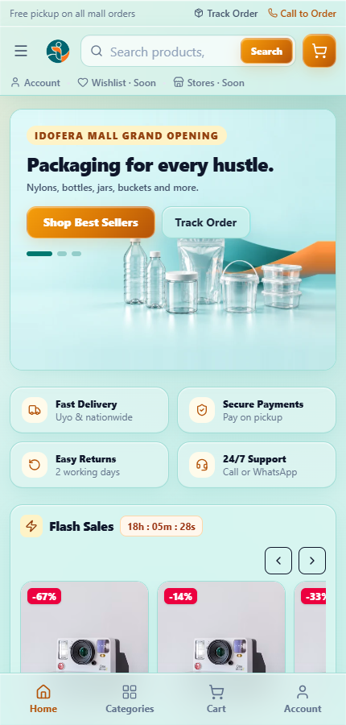
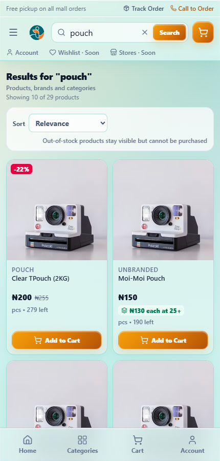
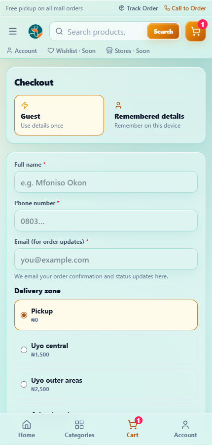
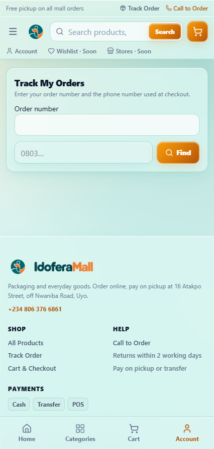

# IdoferaMall — Storefront Help Guide

This guide is for **customers shopping on the IdoferaMall storefront**. It explains how
to browse, add items to your cart, check out, pay, and track your order. You can hand it
to a customer as-is.

Staff running the shop should read [`docs/user-help.md`](./user-help.md) instead.

> Screenshots below are from a demo storefront; product names and prices are examples.

---

## 1. Finding your way around

The storefront is a shop you can browse like any online store. Every product you can buy
is **Active and in stock** — out-of-stock items may still be shown, but they cannot be
purchased.

The main areas:

- **Home** — featured items, categories, and rails such as flash sales.
- **Categories** — the category bar on desktop, or the menu on a phone.
- **Search** — top of every page; type to see matches.
- **Cart** — the basket icon; opens your cart drawer.
- **Account** — takes you to order tracking.

On a phone, the bottom bar gives you **Home**, **Categories**, **Cart**, and **Account**.

### Browsing and searching

- Type in the search box to see results update as you go. Search matches products,
  brands and categories, and is forgiving of minor spacing and typos.
- Sort results with the **Sort** control (for example, by relevance or price).
- Some products advertise a **wholesale tier**, shown as a chip like "₦130 each at 25+".
  Buying that quantity automatically charges the lower per-unit price.
- Open any product to see its full description, price, availability, and any tier, then
  **Add to cart**.

---

## 2. Your cart

Open the **cart** to review your items and totals, then continue to checkout, where the
**Order Summary** shows the full breakdown.

The order summary may offer ways to reach a better price:

- A per-item prompt such as "Add N more → pay X each", with the amount you would save.
- A whole-cart banner such as "Add ₦X more → wholesale" with a one-tap **Unlock** that
  jumps the line up to the threshold.

Lines that have earned a discount are tagged with a **Wholesale** badge. These offers only
appear when there is enough stock to actually reach the tier — you are never promised a
price the shop cannot fulfil.

When you are ready, continue to checkout.

---

## 3. Checkout

The checkout page collects your details and delivery choice. This is also where the
**Order Summary** totals your basket and any wholesale savings.

1. **Review** your items and totals.
2. Enter your **Full name**, **Phone number**, and **Email**. Your email is used for order
   confirmation and status updates.
3. Choose a **Delivery zone**:
   - **Pickup** — no delivery fee; you collect from the shop.
   - **Uyo central** and **Uyo outer areas** — fixed fees shown at checkout.
   - **Other locations** — a staff member confirms the fee before you pay.
4. Enter the **delivery address**. For pickup this becomes an optional pickup note.
5. Choose how you will pay:
   - **Pay on pickup**, or
   - **Bank transfer** — your order instructions show the bank details.
6. Optionally tick **Remember my details on this device** so you do not retype them next
   time.
7. Press **Place Order**.

After ordering you land on a confirmation screen showing your **order number** with a
**Copy order number** button — keep that number to track your order.

---

## 4. Tracking your order

Open **Track My Orders** (from the confirmation screen, the **Track Order** link in the
footer, or the **Account** tab on a phone).

Enter:

- your **Order number**, and
- the **phone number you used at checkout**.

You must provide **both** — this is a privacy control, not a full login, so nobody else
can look up your order with just one detail. The results show your order's current status
and, where available, when it was last updated.

**What the statuses mean**

| Status | What it means |
| --- | --- |
| Pending review | We have your order and are checking it |
| Confirmed | Accepted; preparation will start |
| Processing | Being prepared |
| Packed | Packed and ready |
| Ready for pickup | Waiting for you at the shop (pickup orders) |
| Out for delivery | On the way to you (delivery orders) |
| Completed | Finished — collected or delivered |
| Cancelled | Cancelled; if you paid, a refund is arranged |
| Refunded | Money returned |

---

## 5. Paying

### Pay on pickup

Choose this if you would rather pay when you collect. Bring your order number.

### Bank transfer

1. Your order shows the bank details to use.
2. Transfer the **exact total** and use a **unique reference**.
3. Tell the shop if you have not received a confirmation — staff match your transfer by
   reference and phone number.

> **Do not pay again if you are unsure.** A cancelled order must never be paid a second
> time. Contact the shop first and let them confirm what happened.

---

## 6. Delivery and pickup

- **Pickup** collects from the shop address and hours shown on the site.
- **Uyo central** and **Uyo outer areas** have fixed delivery fees shown at checkout.
- **Other locations** are quoted by staff before you pay, because the fee depends on where
  you are.

If an address cannot be served, the shop will contact you — delivery orders are only
confirmed once staff have verified the address is serviceable.

---

## 7. Questions customers often ask

**"How do I know my order went through?"**
You get a confirmation screen with an order number. If you gave an email, you also receive
order updates there.

**"Where is my order?"**
Use **Track My Orders** with your order number and checkout phone number. Staff can also
look it up for you.

**"Can I buy wholesale / in bulk?"**
Yes — many products have a wholesale tier. Add enough of the item and the lower per-unit
price applies automatically; the cart will prompt you when you are close.

**"Why is an item showing but I cannot buy it?"**
It is out of stock or has no price set. The storefront keeps such products visible, but
purchasing is only possible when there is stock and a valid price.

**"The page looks empty."**
Refresh once. If it still does not load, check your connection and try again.

---

## 8. Where to get help

- **Track Order** in the footer, or the **Account** tab on a phone, for order status.
- The contact phone and shop details shown in the site footer.
- If you are the shop operator, see [`docs/user-help.md`](./user-help.md) and
  [`docs/mall-operations.md`](./mall-operations.md).
