# IdoferaLabs — Staff Workspace Help Guide

This guide is for **staff using the workspace day to day**: shop staff, managers, and
accountants. It explains what each screen does, the order in which things should be done,
and the rules the system enforces so you are never surprised by a blocked action.

Shopping on the customer-facing storefront is covered separately in
[`docs/mall-storefront-help.md`](./mall-storefront-help.md).

Operator-facing references (deployment, activation, monitoring) live in:

- [`docs/mall-operations.md`](./mall-operations.md) — Mall activation, monitoring, notifications, lifecycle.
- [`docs/04-relational-backend.md`](./04-relational-backend.md) — data model and backend behaviour.
- [`docs/mall-launch-safety.md`](./mall-launch-safety.md) — go-live gates and safety checks.

> All screenshots below are captured from a populated local workspace, so figures and
> order numbers are sample data.

---

## 1. Getting in

The workspace is separate from the public storefront. Staff pages live under `/labs`
(the older `/app` path still redirects). If you have no valid staff session you are sent
back to the storefront instead of being shown the form.

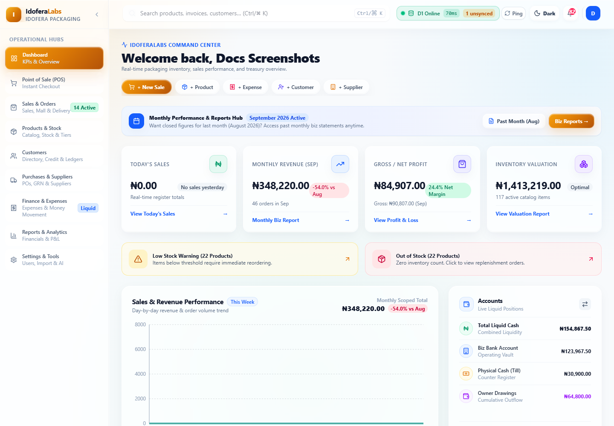

**Signing in**

1. Open the staff workspace URL. If you are not signed in you land on the **Login** page.
2. Enter your credentials (or use the offered Google / email sign-in where enabled).
3. Once authenticated you are taken to your **Dashboard**.

**Notes**

- Your role decides which hubs appear in the sidebar. Pages you are not allowed to open
  are hidden; if you reach one directly, you see an **Access Restricted** card with a
  **Return to Dashboard** button.
- Staff sessions expire for security. If a page suddenly asks you to sign in again, sign
  in and continue — nothing saved to the database is lost.
- On small screens the header shows a menu toggle. On desktop the sidebar can be
  **collapsed to an icon rail** (chevron at the top of the sidebar); the choice is
  remembered on that device.
- On supported browsers the app can be **installed** like a native app, which makes POS
  usable full-screen.

---

## 2. Roles and what they can do

There are four standard roles. A user's role gates both the pages they can open and the
buttons they can press.

| Role | Typical use | Page access highlights |
| --- | --- | --- |
| **Administrator** | Owner / full control | Everything, including Settings, Import, user management, and every management action |
| **Store Manager** | Day-to-day operations and approvals | All operational hubs; approves delivery quotes, cancellations, listing changes |
| **Sales Staff** | Counter and order handling | Dashboard, POS, Sales & Orders, Products & Stock, Customers, Settings |
| **Accountant** | Money, reconciliation, reporting | Dashboard, Sales & Orders, Customers, Purchases & Suppliers, Finance & Expenses, Reports |

Important nuances:

- **Administrator is effectively unrestricted.** The permission check treats the
  Administrator role as allowed everywhere; other roles are matched against an explicit
  allow-list per page.
- **The Super-User account** is a special protected login (used for initial setup and
  role switching). A regular Administrator cannot modify, delete, or reset its password.
- There must always be at least one Administrator; the system refuses to delete the last
  one.
- **Some actions are narrower than the page.** For example, on the Mall Orders tab, only
  Administrators and Store Managers can confirm delivery-address serviceability, cancel
  orders, or set a delivery quote, and only Administrators and Accountants can process
  refunds. The buttons simply are not shown to other roles.

If a button you expect is missing, it is almost always a role restriction — not a bug.

---

## 3. The workspace, hub by hub

The sidebar is organised into eight **Operational Hubs** plus a **Settings** hub. Several
hubs contain tabs.

### 3.1 Dashboard

Your landing page and the business at a glance.


- **Command Center** with quick actions: **New Sale**, **New Product**, **New Expense**,
  **New Customer**, **New Supplier**.
- **KPIs and overview** — today's sales, stock and money signals for the period.
- **Monthly Performance & Reports Hub** — jump to the current or previous month's
  statements.
- Day-based figures use your **local calendar**, so a "today" total matches the working
  day at the shop, not UTC.
- Most cards navigate straight to the relevant hub, so treat it as a launch pad.

### 3.2 Point of Sale (POS)

Counter terminal for fast in-person sales. Roles: Administrator, Store Manager, Sales
Staff.

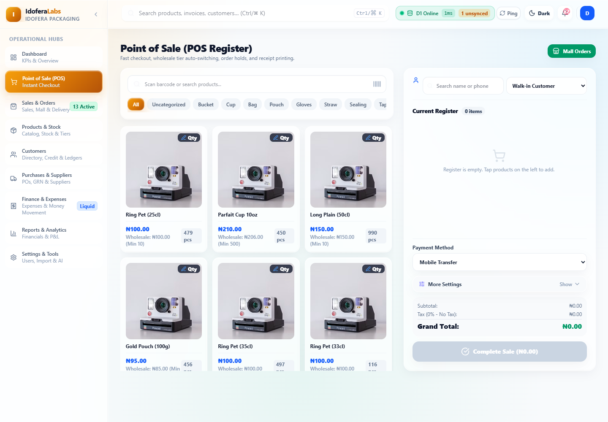

**Making a sale**

1. Find products on the left — search, or tap product cards.
2. Add items to the cart. The cart on the right totals as you go.
3. Optionally attach a **customer** (needed for a credit sale) and apply a **discount**.
4. Choose the **Payment Method**: `Card`, `Cash`, `Mobile Transfer`, or
   `Split Payment`.
   - For **Split Payment**, enter the amount taken by each tender. The system shows
     whether the split covers the order before you can complete it.
   - For single-tender sales you may enter an **amount tendered / paid** to work out
     change.
5. Press **Complete Sale** (the button shows the amount being taken). A receipt is
   produced.

**Wholesale tiers happen automatically.** When a line reaches the product's minimum
wholesale quantity, that line is charged the wholesale price — but only when it is a
genuine discount that stays above the product's floor price. It can never raise a price
or beat a better active promotion. The product cards show the tier, e.g.
"Wholesale: ₦100.00 (Min 10)".

**Credit sales and holds**

- **Credit pricing mode** applies the defined credit price to eligible items and records
  the debt against the customer's ledger.
- **Order holds** let you park an in-progress cart and resume it later.

**Receipts** — after checkout the receipt can be viewed and printed. It records the sale
lines, totals, tender and any split breakdown.

### 3.3 Sales & Orders

A three-tab hub: **Sales Records**, **Mall Orders**, and **Deliveries & Pickups**. The
Deliveries tab shows a pending count when pickups await confirmation, and the sidebar
shows an **Active** badge when there is actionable work across sales and Mall orders.

#### Tab — Sales Records

The history of completed sales, with a **daily calendar** view and an **All Sales
Records** table.

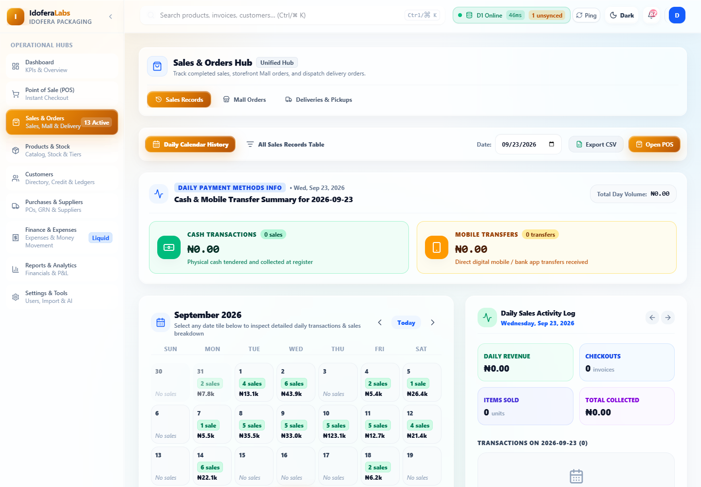

Search and filter to find a past transaction, then open it to review its lines, tender,
customer and receipt. The header also summarises totals by payment method (Cash, Card,
Mobile Transfer).

#### Tab — Mall Orders

This is where you work online storefront orders. It is the most workflow-driven screen,
so the details matter.

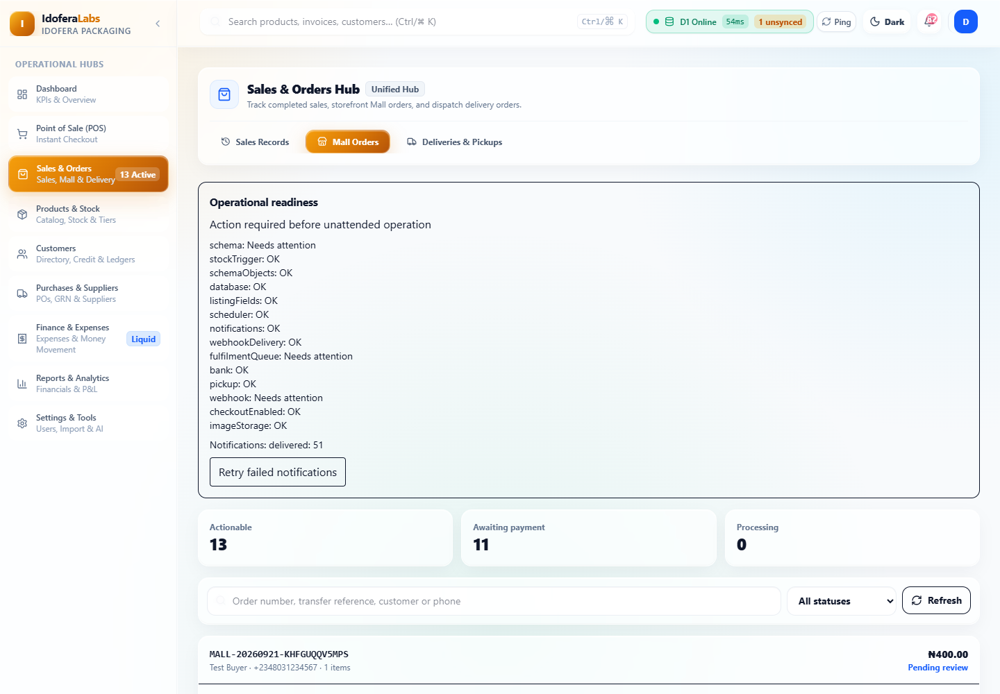

**The list** shows every Mall order with order number, customer, item count, total and
status. Use the search box (order number, transfer reference, customer name or phone) and
the status filter, then **Refresh** — the list also auto-refreshes periodically.

Three counters sit above the list: **Actionable**, **Awaiting payment**, and
**Processing**.

Managers additionally see an **Operational readiness** panel: whether checks are passing,
notification counts, and a **Retry failed notifications** button. Treat "unavailable" as
unknown, not as healthy.

**Opening an order** shows the full detail: items, delivery zone/address, totals, the
**Order timeline** (who did what, when), payment state and every action available to you.

**The order lifecycle** the system enforces:

```
pending → confirmed → processing → packed → ready_for_pickup → completed
                                   packed → out_for_delivery → completed
```

- **Confirm Order** — moves a `pending` order to `confirmed`.
- **Start Processing → Mark Packed → Mark Ready for Pickup → Complete Pickup** — the
  pickup chain.
- **Send Out for Delivery** (from `packed`, delivery orders only) requires an **Assigned
  courier**; then **Mark Delivered** completes it.
- **Cancel Order** (Administrator / Store Manager) — for unpaid orders; cancels the
  pending payment and **releases the stock**.
- **Reject payment and cancel order** (Administrator / Store Manager) — for a transfer
  you could not verify. This cancels and releases stock rather than pretending money
  arrived.

**Payment**

- **Tender** choices are Cash, Card, Mobile Transfer and Bank Transfer, plus a
  **Reference** field.
- **Collect Payment & Create Sale** records the money and creates the corresponding sale.
- **Verify Transfer & Create Sale** is used for Bank Transfer once you have confirmed the
  deposit. Payment status becomes paid atomically with the sale and accounting entry.

**Delivery orders have extra gates.** Before an order can be confirmed or paid, staff must
verify the address is serviceable: press **I verified this address is serviceable within
the selected zone**. Other-location orders also need a **delivery quote** — enter the
**Delivery fee (₦)** and **Save Delivery Quote** before confirming or taking payment. A
delivery order can never enter the pickup branch, and a pickup order can never be
dispatched.

**Refunds** (Administrator / Accountant) require a **reason** and an explicit **stock
disposition**:

- *Returned / never dispatched* — restock the goods.
- *Not returned / not resellable* — do not restock.

If goods had already been dispatched or collected, restocking also needs a
**goods-received reference**. Partial refunds and partial returns are not supported.

**Practical rules to avoid mistakes**

- Do not pay a customer's order twice. A cancelled order must not be reactivated
  automatically; if a late bank receipt arrives after cancellation, handle it as a manual
  exception with the customer.
- Cancelling releases stock; do not also adjust stock by hand for the same order.
- Unverified transfers should be cancelled, not marked paid.

#### Tab — Deliveries & Pickups

Dispatch and pickup operations, filterable by status (**All**, **Pending Pickup**,
**Picked Up**, **Out for Delivery**, **Delivered**, **Cancelled**).

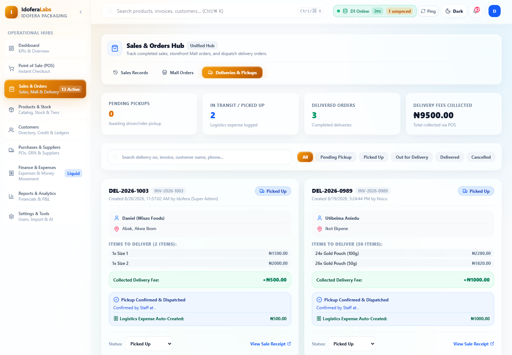

A delivery tied to a Mall order stays in step with that order — conflicting changes made
from this generic view are rejected. Always make the change in the place that owns the
workflow (Mall Orders for Mall orders).

### 3.4 Products & Stock

One hub with five tabs: **Product Catalog**, **Stock Control & Movements**, **Multiple
Pricing Tiers**, **Mall Listings**, and **Archived Products**.

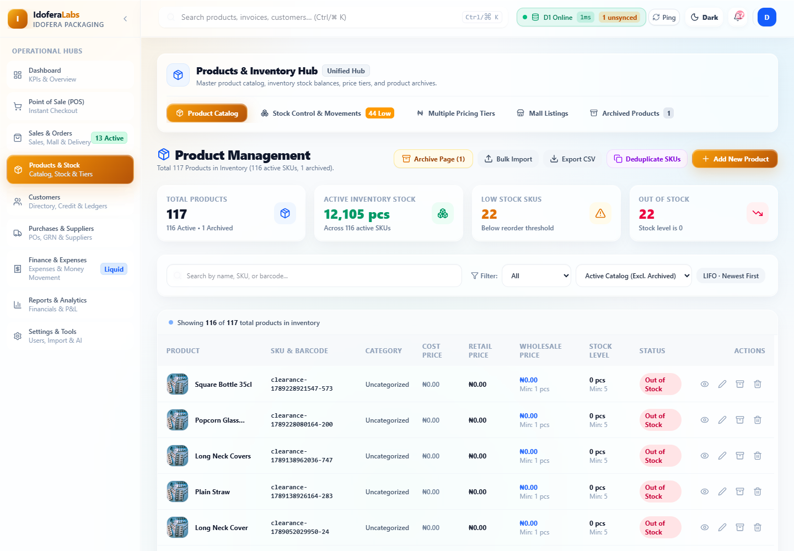

- **Product Catalog** — create and edit products, set prices and stock. Product images are
  uploaded here; the app downscales them in the browser first, so you do not need to
  pre-size them.
- **Stock Control & Movements** — stock levels and stock movement history, so you can see
  what changed and why.
- **Multiple Pricing Tiers** — retail, wholesale (with a minimum wholesale quantity), the
  minimum floor price, credit price and the optional promotional price.
- **Mall Listings** — the storefront-specific overrides (see section 4).
- **Archived Products** — retired products. Archiving is how you retire a product without
  losing its history.

**How pricing drives the storefront** (so shop and online prices agree):

- **Retail Selling Price** is the default online price when there is no override.
- **Wholesale Price** becomes an automatic per-line tier online once a cart line reaches
  the minimum wholesale quantity.
- **Minimum Floor Price** protects every price source — no promo or automatic tier can
  take the storefront below it.
- **Promotional Price** (the flat POS promo field) only reaches the storefront when an
  administrator enables it for the deployment. Order of precedence online is: active Mall
  promo window → Mall price → POS promo (if enabled) → retail.
- **Dealer / B2B Price** is not used on the storefront.

### 3.5 Customers

The customer directory, credit and ledgers.

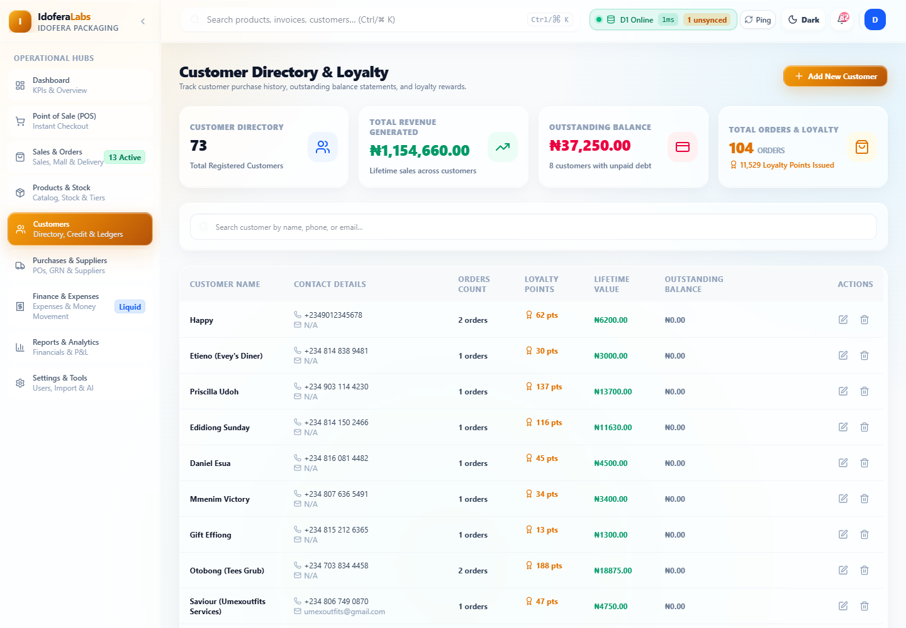

- Look up a customer and open their history.
- See balances and credit activity. Credit sales made at the POS post to the customer's
  ledger, so the balance here reflects what the shop is owed.
- Keep phone numbers accurate — the storefront matches orders by phone number, and numbers
  must be well-formed to match.

### 3.6 Purchases & Suppliers
Two tabs: **Purchases** and **Suppliers**. Roles: Administrator, Store Manager,
Accountant.

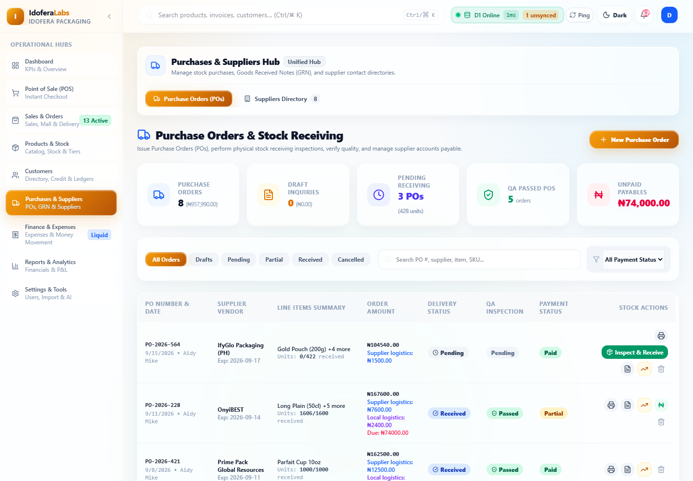

- **Purchases** — purchase orders and goods-received records, the counterpart to selling:
  this is how stock re-enters the shop.
- **Suppliers** — the supplier directory.

### 3.7 Finance & Expenses
Tabs for **Expenses & Money Movement**, **Money Movement**, and **Investment Planner**.
Roles: Administrator, Store Manager, Accountant.

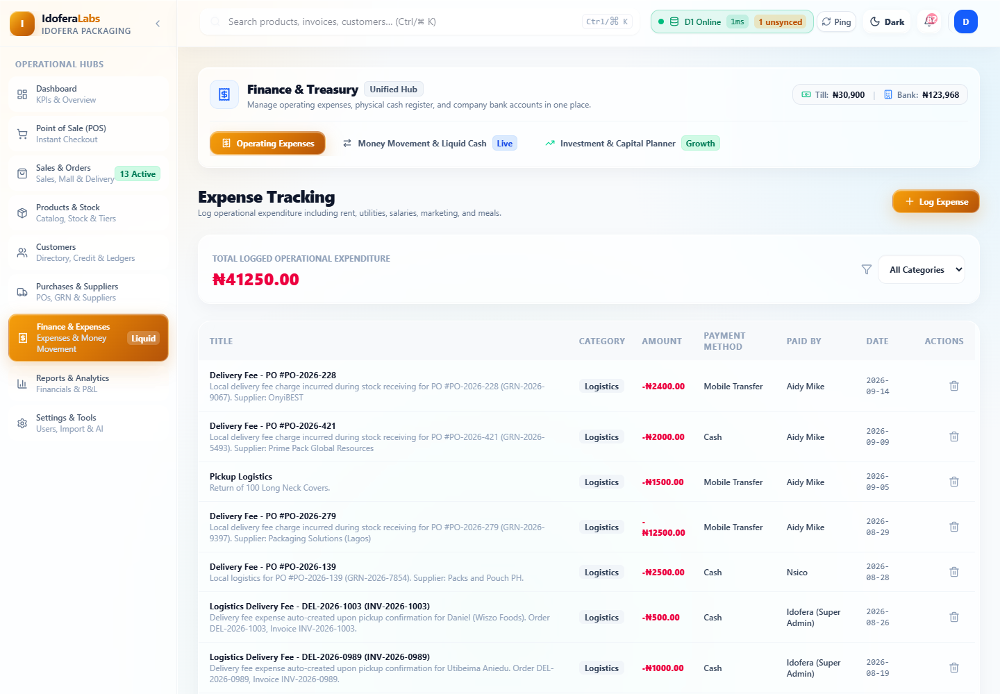

- **Expenses** — record and categorise business expenses.
- **Money Movement** — the flow of money between accounts, with treasury balances. Sale
  inflows (including Mall orders) are recorded here.
- **Investment Planner** — capital and investment planning views.

### 3.8 Reports & Analytics
Financial reporting and P&L. Roles: Administrator, Store Manager, Accountant. Use this to
review performance over a period.

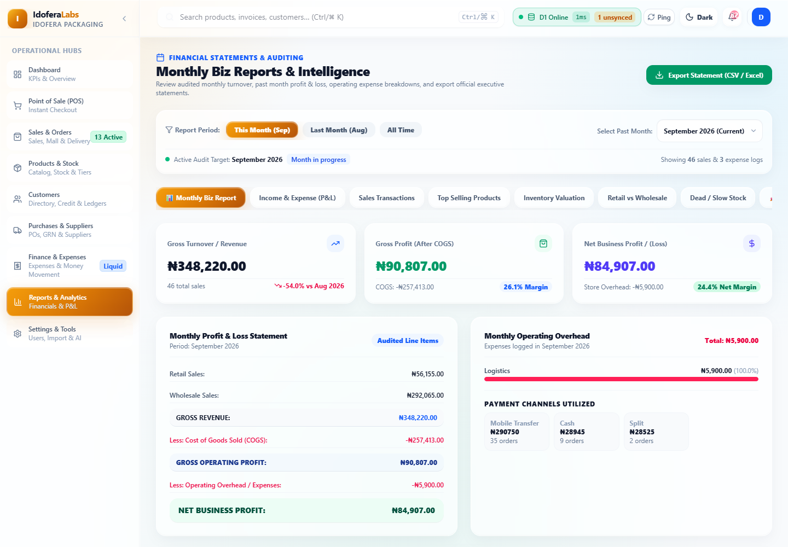

Sub-tabs include **Monthly Biz Report**, **Income & Expense (P&L)**, **Sales
Transactions**, **Top Selling Products**, **Inventory Valuation**, **Retail vs
Wholesale**, and **Dead / Slow Stock**, with period controls such as **This Month**,
**Last Month** and **All Time**. Day-based reports use the **local calendar day**, so
totals line up with the working day.

### 3.9 Settings & Tools
Three tabs: **Settings**, **Import**, and **AI Assistant**.

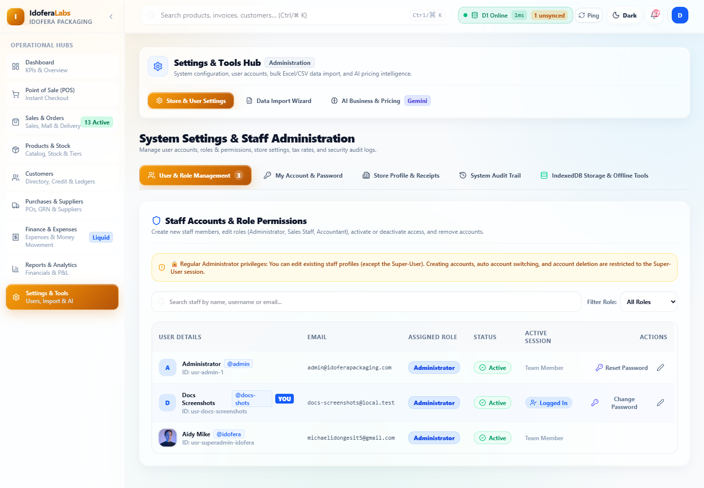

- **Settings** — general configuration, users and roles, and access to tools.
- **Import** (Administrator / Store Manager) — bulk import of existing data.
- **AI Assistant** — the in-app assistant for questions and help. Roles: Administrator,
  Store Manager, Accountant.

**Managing users (Administrator).** You can add users, set their role, reset passwords, and
deactivate accounts. Remember the built-in protections:

- The **Super-User** account is protected from edits, deletion and password resets by
  regular Administrators.
- The **last Administrator** cannot be deleted.

---

## 4. Mall listings — controlling the storefront catalogue

Open **Products & Stock → Mall Listings**.

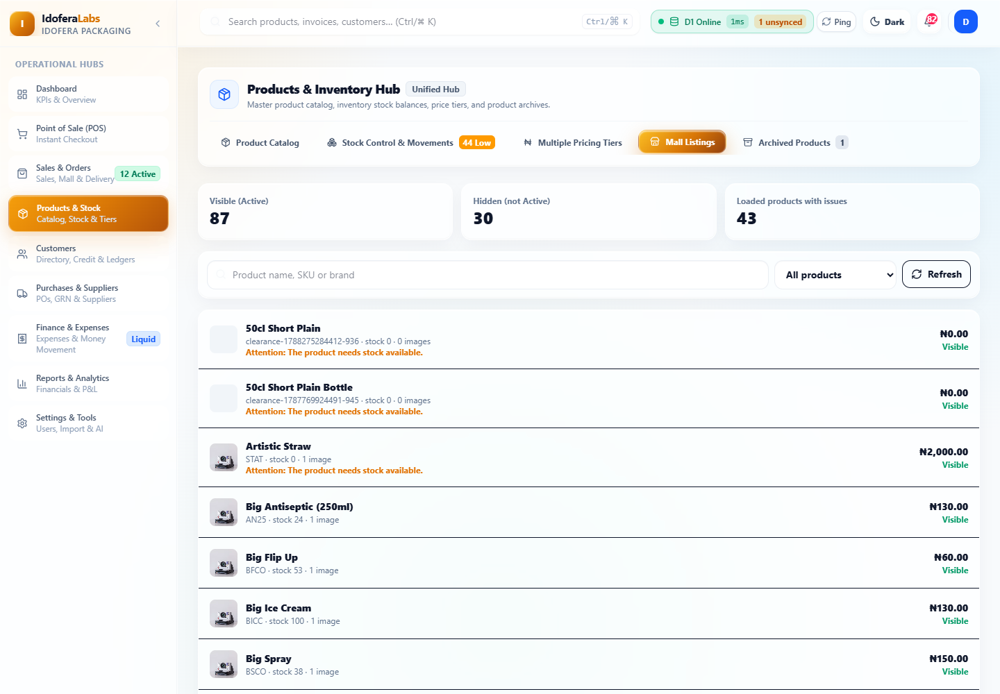

The single rule for Mall visibility is: **Active product status**. Every Active product
appears on the storefront automatically; there is no separate publish step and no approval
queue.

- To **hide** a product from the Mall, set its status to Inactive or Archived in Products.
- To **show** it, set it back to Active.
- Buying online additionally requires **stock** and a **valid price**. A product can be
  visible but not purchasable if it is out of stock or unpriced — the Mall Listings screen
  flags this as an advisory issue (e.g. "The product needs stock available").

The Mall Listings tab shows **Visible / Hidden / Issues** counters and lets you
merchandise each product for the storefront:

- Set a **Mall price** (a positive amount, never below the product's floor price).
- Set a **Mall description** (customer-facing).
- **Feature** a product and set its **display order** (lower shows first).
- Optionally set a **promotional price** with a start and end window (the promo must be
  lower than the normal Mall price, stay above the floor, and end after it starts).

Things to know:

- Listings carry **advisory issues** such as a missing image, no stock, or an unpriced
  product. These warn you — they do not stop the list from loading.
- If images were uploaded before the current image system, a listing may be flagged until
  you re-upload the image.
- Saves are **protected against conflicting edits**: if someone else edited the same
  listing first, your save is rejected and you must reload to see their version before
  retrying.

---

## 5. Common tasks, step by step

**Ring up a walk-in sale**
POS → add items → optional customer/discount → choose payment method → **Complete Sale**.

**Take a Mall order from new to collected**
Sales & Orders → Mall Orders → open the order → (delivery? verify address + quote fee) →
**Confirm Order** → **Start Processing** → **Mark Packed** → **Mark Ready for Pickup** →
**Complete Pickup**.

**Dispatch a Mall delivery**
…→ **Mark Packed** → enter **Assigned courier** → **Send Out for Delivery** → **Mark
Delivered**.

**Confirm a bank transfer payment**
Open the Mall order → set **Tender** to Bank Transfer and enter the **Reference** →
**Verify Transfer & Create Sale**.

**Cancel an unpaid Mall order**
Open the order → set a **Cancellation reason** → **Cancel Order** (stock is released). If
the issue is an unverifiable transfer, use **Reject payment and cancel order** instead.

**Refund a paid Mall order**
Open the order → enter **Refund reason** → choose **Stock disposition** → add a
**goods-received reference** if goods had already left the shop → **Refund Sale**.

**Change what appears on the Mall**
Products & Stock → Mall Listings (section 4).

---

## 6. Messages, notifications and statuses

- **In-app toasts** confirm successes ("Order confirmed") and explain failures. Read the
  message — it tells you what the system actually did.
- **Order statuses** you will see: Pending review, Confirmed, Processing, Packed, Ready
  for pickup, Out for delivery, Completed, Cancelled, Refunded.
- **Payment status is separate from order status.** An order can be Confirmed while payment
  is still pending. Payment becomes paid at the moment the sale is created.
- The shop receives **email notifications** for order events (received, paid, dispatched,
  delivered, cancelled, refunded). Customers who supplied an email also receive
  customer-facing updates.

---

## 7. Troubleshooting

**"Access Restricted" page**
Your role does not include that page. Use **Return to Dashboard**, or ask an Administrator
if you need the access.

**A button I need is not shown**
Most management actions are role-limited (for example, delivery quotes and cancellations
are Administrator / Store Manager; refunds are Administrator / Accountant). This is
intended.

**"A delivery quote is required before confirmation or payment."**
The order is to an "other location" zone. Enter the delivery fee and **Save Delivery
Quote**, then continue.

**"I verified this address…" is shown**
Delivery orders need address serviceability confirmed before confirmation/payment. If you
genuinely verified the address is serviceable in the zone, press it.

**Confirm/Pay buttons are disabled**
Check the order status. Confirm only applies to `pending`; payment cannot be taken on an
order that is still `pending`. Also make sure the courier field and quote requirements
above are satisfied where they apply.

**I type one character and the cursor jumps / I cannot type**
This was a defect in the modal's focus handling and has been fixed. If you see it again,
note the screen and the field, refresh once, and report it — it should not recur.

**A Mall listing change was rejected**
Another editor changed it first. Reload the listing to get the current version, then
re-apply your change.

**The workspace looks empty / no data loads**
Refresh once. If a page shows an error with a Retry action, press it. Persistent errors
usually mean a connectivity or sign-in problem — re-authenticate and try again.

---

## 8. Good practice and safety

- **Never** mark a payment as received unless you have actually confirmed it.
- **Cancel rather than fake** when a transfer cannot be verified — this releases stock
  correctly.
- Take refunds and returns seriously: always record a reason and the correct stock
  disposition, and use a goods-received reference when goods had already left the shop.
- Keep **stock, prices and product status** accurate — the Mall sells from the same
  records; a wrong status hides a product and a wrong price sells it wrong.
- Keep **phone numbers** well-formed for customers; the storefront matches by phone.
- Treat delivery addresses and customer contact details as **private information**.

---

## 9. Where to get help

- In the app: **Settings & Tools → AI Assistant**.
- Customer-facing help: [`docs/mall-storefront-help.md`](./mall-storefront-help.md).
- Deployment, activation and monitoring: [`docs/mall-operations.md`](./mall-operations.md).
- Data model and backend behaviour: [`docs/04-relational-backend.md`](./04-relational-backend.md).
